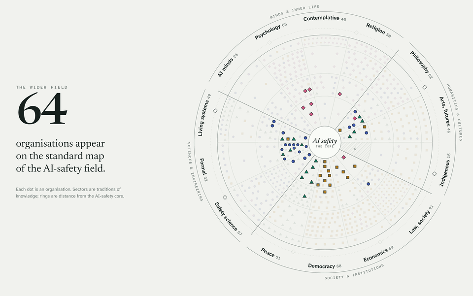
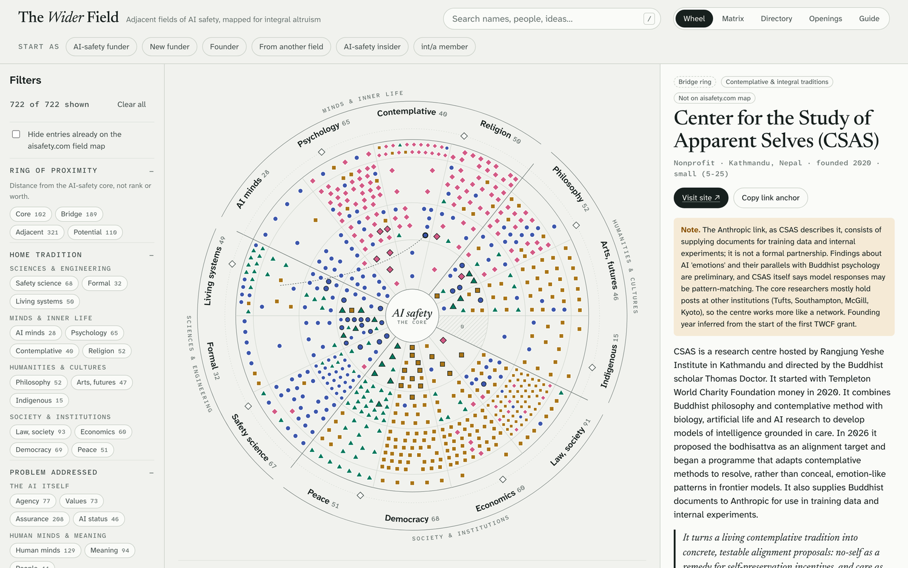
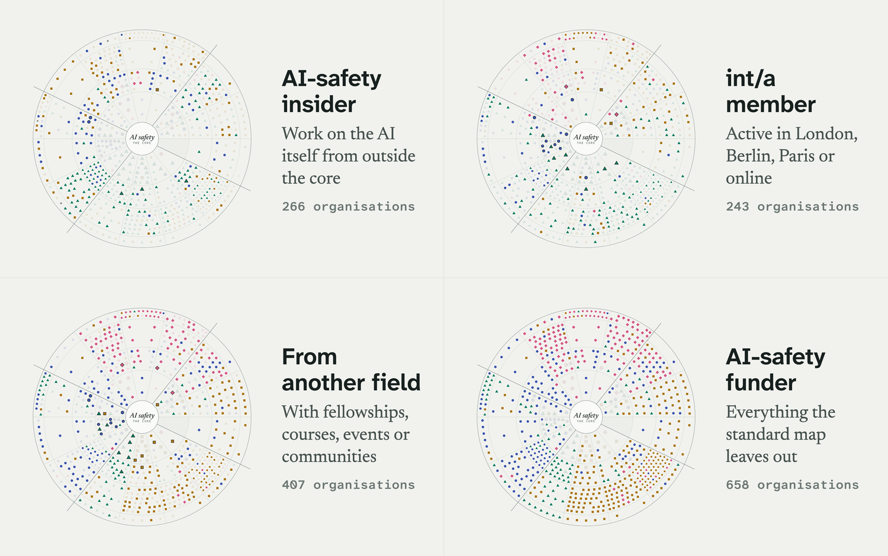
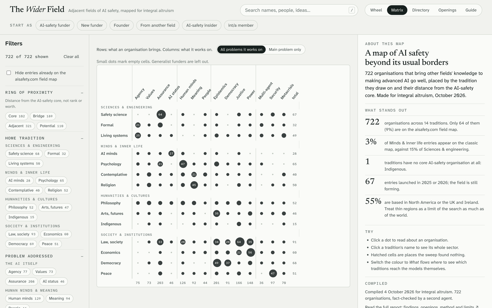
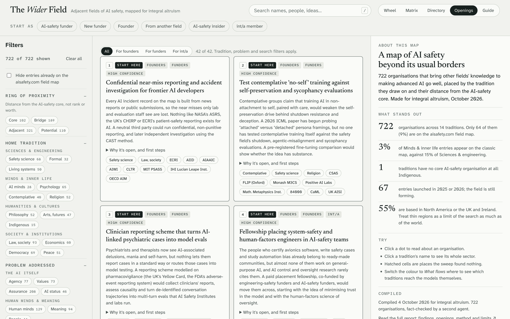
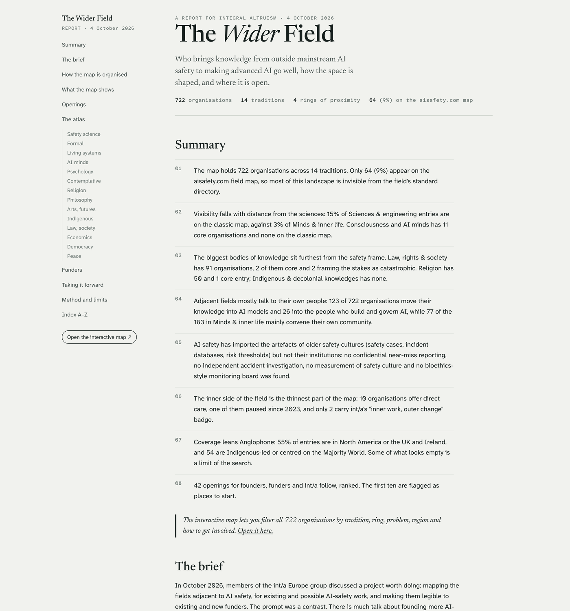
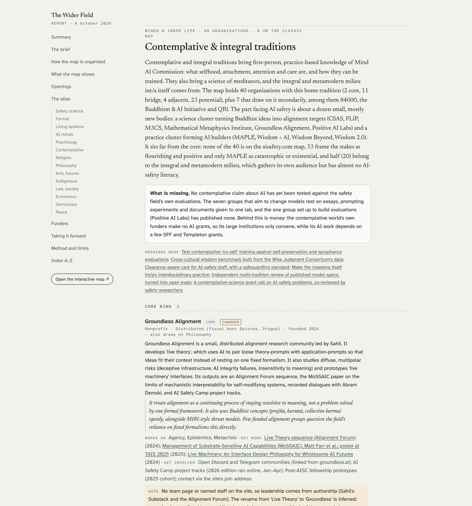

<div align="center">

# The Wider Field

### AI safety is bigger than its map.

722 organisations that bring other fields' knowledge to making advanced AI go well, from psychiatry and contemplative science to arms control, actuarial science and Indigenous data sovereignty. One interactive map, one report, and 42 places where the field is still open.

<a href="https://claude.ai/artifact/MrKYZmhwbuxCf2tf3cmcnw"></a>
&nbsp;
<a href="https://claude.ai/artifact/ThNQqeD4nn1caCT9ihWwHL"></a>

<br>

<a href="https://claude.ai/artifact/MrKYZmhwbuxCf2tf3cmcnw">
<picture>
  <source media="(prefers-color-scheme: dark)" srcset="docs/media/hero-dark.gif">
  
</picture>
</a>

<sub>Each dot is an organisation. Sectors are traditions of knowledge; rings are distance from the AI-safety core.</sub>

</div>

## Why this exists

The aisafety.com field map lists about 370 organisations working on AI safety, grouped by what they do, such as research, governance, advocacy and funding. Its focus is the core of the field. This map covers the organisations around that core that bring knowledge from other disciplines and traditions to making advanced AI go well. It places each one by the tradition it draws on and by how close it sits to AI safety. **Of the 722 organisations here, 64 also appear on the aisafety.com map.**

In October 2026 the integral altruism (int/a) Europe group asked for a project that would *widen* the field, not just found more of what it already has: map the adjacent fields, make them legible to funders, and give founders a concrete list of problems. This is that map.

<div align="center">

| **722** | **14** | **9%** | **43 of 196** | **42** |
|:---:|:---:|:---:|:---:|:---:|
| organisations, profiled and fact-checked | traditions of knowledge, in four families | already on the standard field map | combinations of tradition and problem with nobody working on them | ranked openings for founders, funders and int/a |

</div>

## The interactive map

<table>
  <tr>
    <td width="50%" valign="top">
      <a href="https://claude.ai/artifact/MrKYZmhwbuxCf2tf3cmcnw"></a>
      <p><b>See the whole field at once.</b><br>Every dot is an organisation, placed by the tradition it draws on and how close it sits to the AI-safety core. Click one for its profile: what it does, why it matters, key work, people, funding and how to get involved.</p>
    </td>
    <td width="50%" valign="top">
      <a href="https://claude.ai/artifact/MrKYZmhwbuxCf2tf3cmcnw"></a>
      <p><b>Start from where you stand.</b><br>Six entry points (AI-safety funder, new funder, founder, someone from another field, AI-safety insider, int/a member) reframe the map around your question. The same field lights up differently for each of them.</p>
    </td>
  </tr>
  <tr>
    <td width="50%" valign="top">
      <a href="https://claude.ai/artifact/MrKYZmhwbuxCf2tf3cmcnw"></a>
      <p><b>Find the empty niches.</b><br>Cross what organisations bring with what they work on. Every small grey dot is a place where the knowledge exists and nobody has carried it across yet.</p>
    </td>
    <td width="50%" valign="top">
      <a href="https://claude.ai/artifact/MrKYZmhwbuxCf2tf3cmcnw"></a>
      <p><b>Act on it.</b><br>42 openings, ranked, each grounded in the map: what is missing, what would fill it, who is already nearby, and the first steps.</p>
    </td>
  </tr>
</table>

Also in the map:

- **Filters** by ring, tradition, problem, what an organisation does, how to get involved, region and status, with live counts.
- **Lenses from int/a's own frames:** colour the wheel by integral quadrant, by *what flows where* (does a field's knowledge reach the AI models, the people who build them, institutions, or mainly its own community?) or by what each organisation says is at stake.
- **Ask the map** a question in plain words, such as *"Who in Europe works on care-based alignment?"*, and the answer is highlighted on the wheel. This uses your own Claude account.
- **Link to any organisation** directly, and switch between light and dark mode. It also works on a phone.

## The report

<table>
  <tr>
    <td width="50%" valign="top">
      <a href="https://claude.ai/artifact/ThNQqeD4nn1caCT9ihWwHL"></a>
      <p><b>Findings you can cite.</b><br>The shape of the wider field in ten findings and four figures, with the numbers behind each.</p>
    </td>
    <td width="50%" valign="top">
      <a href="https://claude.ai/artifact/ThNQqeD4nn1caCT9ihWwHL"></a>
      <p><b>The full atlas.</b><br>All 722 organisations, tradition by tradition and ring by ring, each with what it does, why it matters and how to get involved.</p>
    </td>
  </tr>
</table>

**Some of what the report finds:**

- **The field's visibility tracks distance from the sciences.** 15% of science and engineering organisations are on the standard map, against 3% of those in psychology, contemplative traditions, religion and consciousness research. Consciousness and AI-minds research has 11 core AI-safety organisations, and none of them is on the standard map.
- **The largest bodies of knowledge sit furthest out.** Law, rights and society has 91 organisations and only 2 in the core. Indigenous and decolonial knowledges have none.
- **Adjacent fields mostly talk to their own people.** 123 organisations move their knowledge into AI models, and only 26 into the people who build and govern AI.
- **AI safety borrowed older safety cultures' artefacts, not their institutions.** It has safety cases and incident databases, but no confidential near-miss reporting, independent accident investigation or bioethics-style oversight board was found.
- **The inner side of the field is the thinnest.** Only 10 organisations offer direct care to the people doing the work, and one of them has been paused since 2023.

The report also covers where the money is, including the large new funders of 2025–26, and how int/a could take the map forward. It closes with the method, its limits and an A–Z index.

## Who it's for

| If you are… | Your question | Start here |
|---|---|---|
| Funding AI safety | What relevant knowledge aren't my grantees using? | Map → *AI-safety funder* |
| A new funder | Where could money open something untried? | Map → *Openings* → *For funders* |
| A founder | Which niches are empty, and who could I build with? | Map → *Matrix*, then *Openings* |
| From another field | Who in my field already works on AI going well? | Map → *From another field* |
| Working in AI safety | What is in my blind spot? | Map → *AI-safety insider* |
| Part of int/a | Who works near me, and where could int/a add something? | Map → *int/a member* |

## How it was made

<p align="center">
<picture>
  <source media="(prefers-color-scheme: dark)" srcset="docs/media/pipeline-dark.png">
  
</picture>
</p>

AI research agents swept 18 adjacent fields and then a second round of blind spots. They profiled each organisation from its own site and other sources, and tagged it against written rules for 14 traditions, 14 problems and four rings. The categories were designed by four independent designers and scored by two judges with opposite priorities. A second agent fact-checked every profile and corrected 268 of them. Two further coders re-tagged a sample without seeing the original tags, and agreed on an organisation's home tradition 99% of the time.

It is a first draft, and its limits are stated plainly in the report. Expect errors in individual details. Coverage leans English-language: 55% of entries are in North America or the UK and Ireland. The openings are well-grounded hypotheses, not tested plans.

## Help make it better

If you know a field, you can make its sector more accurate. Use **Suggest an addition or correction** in the map, or [open an issue](https://github.com/ZsoltTanko/inta-ai-safety-map/issues). The report proposes taking this further as an int/a practice, reviewed one tradition at a time by the people who know them.

<details>
<summary><b>For AI agents and anyone rebuilding the pages</b></summary>

<br>

- `dist/` holds the two pages as published. The live versions are linked above.
- `data/profiles.json` is the dataset: one record per organisation, with tags whose keys are defined in `data/taxonomy.md`.
- `data/synthesis.json` holds the openings, findings and essays. `src/texts.py` holds the fixed prose.
- `research/` and `workflows/` are the record of how the data was gathered. Their paths point at the original working folder, so they don't run from here.

Rebuild both pages with Python 3 and no dependencies:

```bash
python3 src/synth.py && python3 src/assemble.py && python3 src/build_map.py && python3 src/build_report.py
```

`src/media/make_media.py` regenerates the README images; it needs Google Chrome, ffmpeg and ImageMagick.

</details>

## License

[MIT](LICENSE). Organisation descriptions were written for this project, and each entry links its sources.
